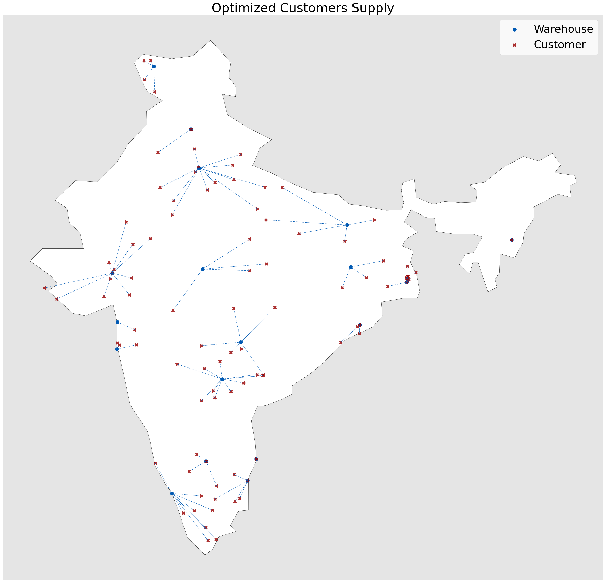

# Capacitated Facility Location Problem (CFLP)

[](https://github.com/Siraj-Adil/CFLP)


## Overview

This project models and solves a **Capacitated Facility Location Problem (CFLP)** to optimize warehouse placement and shipments across 31 Indian regions. The objective is to **minimize total facility and transportation costs** while respecting capacity constraints.

The project combines **mixed-integer linear programming (MILP), geospatial analysis and visualization** to make data-driven facility location decisions.

---

## Features

-   Modeled a **Capacitated Facility Location Problem** for 96+ customer nodes and candidate warehouses.
-   Engineered a **geospatial demand pipeline** using `GeoPandas` and Haversine distances.
-   Solved MILP using **PuLP with CBC solver** (academic Gurobi license optional) for optimal warehouse placement.
-   Simulated stochastic demand to test robustness and reproducibility.
-   Visualized results with **Matplotlib** over a map of India showing customers, facilities, and optimized connections.

---

## Technologies & Tools

-   **Python** – Core language for modeling and analysis
-   **PuLP** – MILP modeling
-   **CBC solver** – Open-source LP/MILP solver (alternative to Gurobi)
-   **Pandas & GeoPandas** – Data handling & geospatial operations
-   **Matplotlib** – Visualization of results

---

## Setup Instructions

1. Clone the repository:

```bash
git clone https://github.com/Siraj-Adil/CFLP.git
cd CFLP
```

2. Install dependencies:

```bash
pip install -r requirements.txt
```

3. Run the notebook:

```bash
jupyter notebook CFLP_Model.ipynb
```

## Data

-   Customer demand and facility candidate locations for 31 Indian regions.
-   Geospatial data from Natural Earth for India boundaries.

## Results

-   Optimized warehouse placement and shipment assignments.
-   Interactive plots showing customer nodes (red X) and potential warehouse locations (blue diamonds) over India.
-   Ability to simulate stochastic demand scenarios for robust decision-making.

> 🔴 Red X = Customer Locations
> 🔵 Blue Diamond = Candidate / Selected Warehouses
> 
